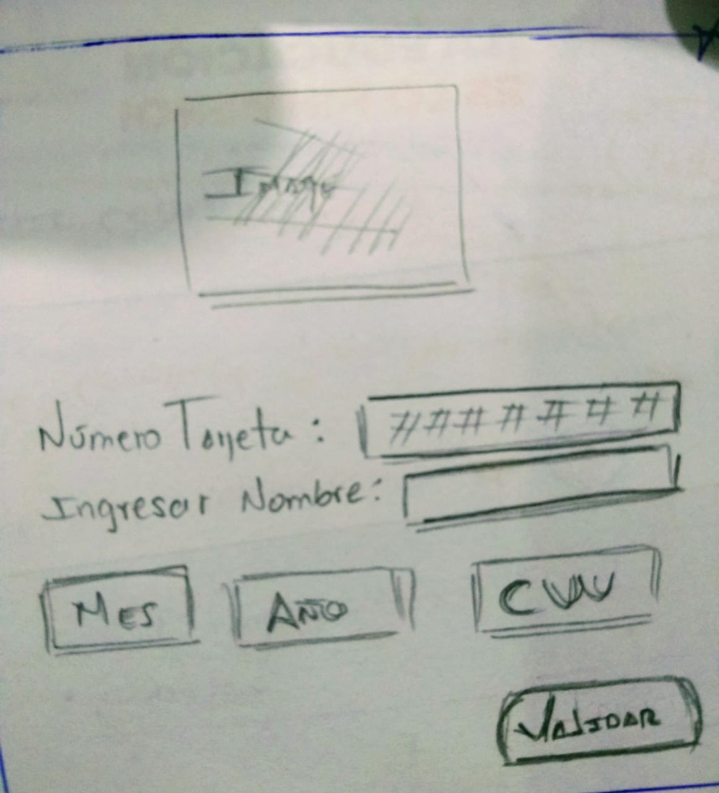
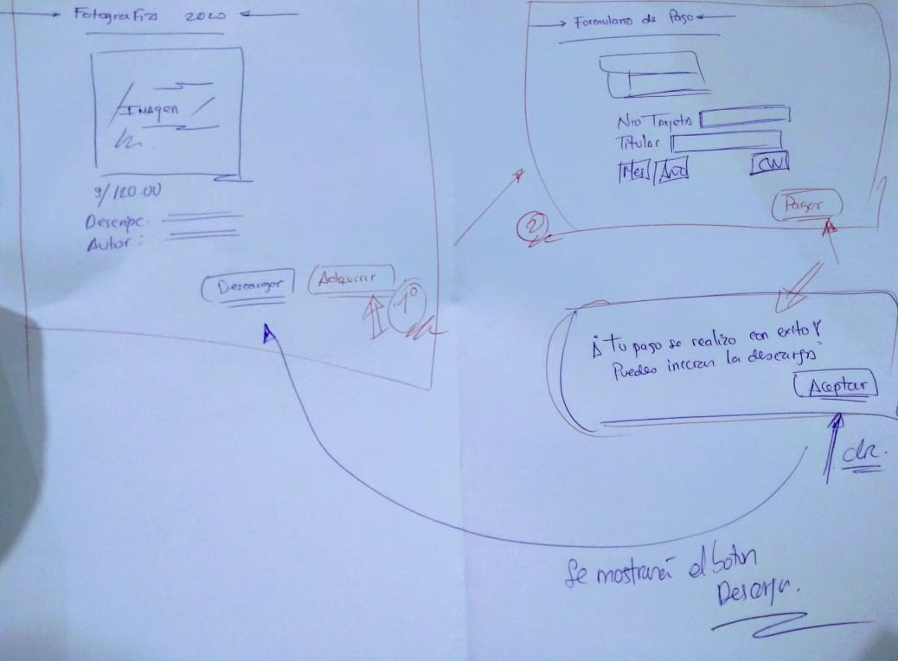
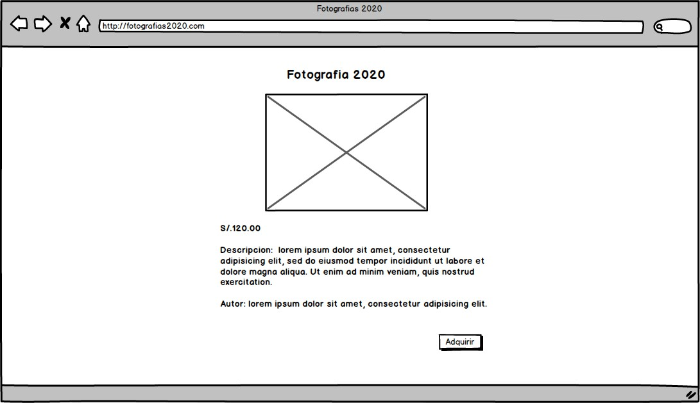
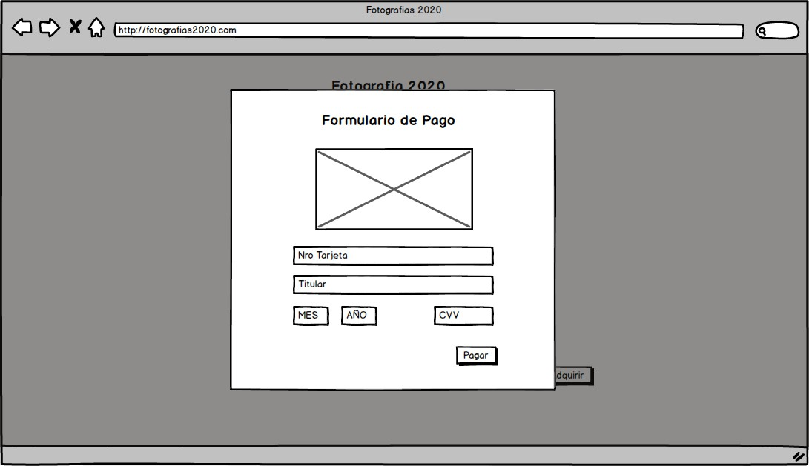
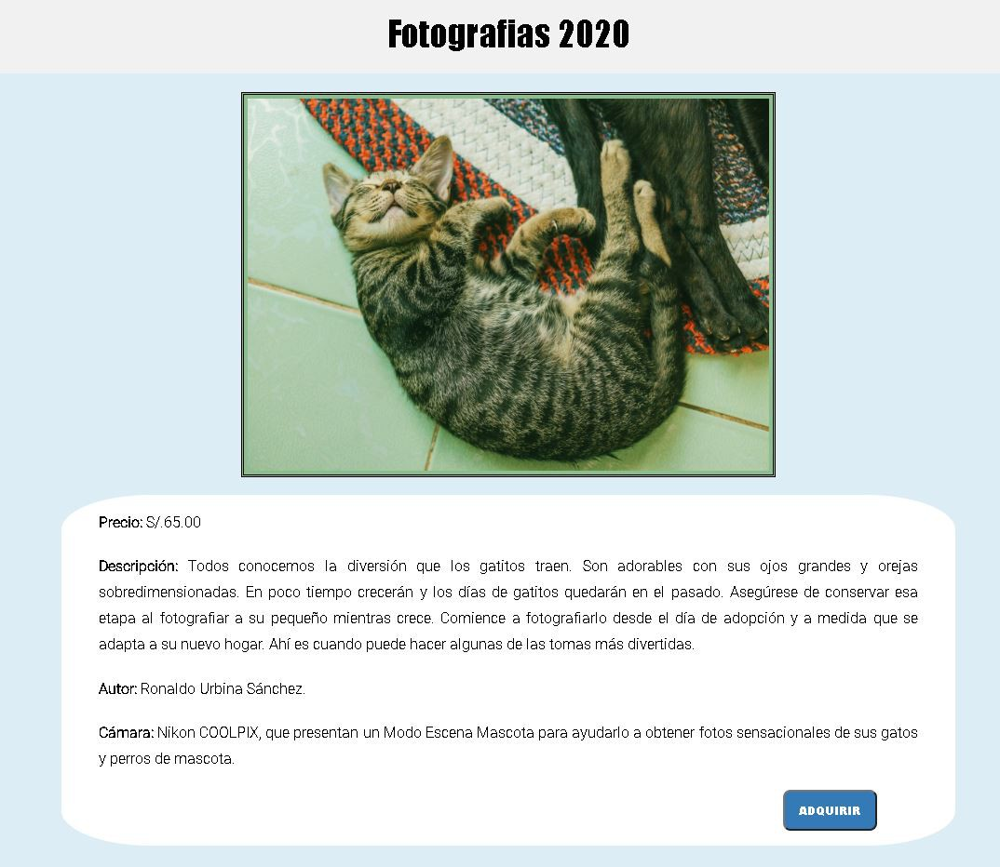
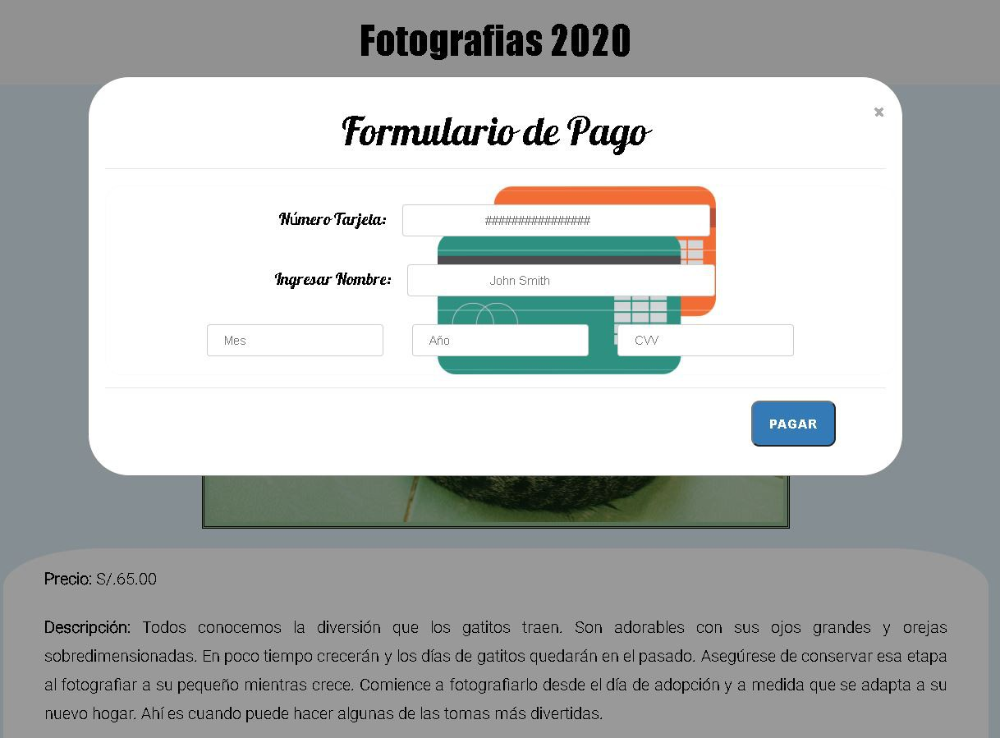

# Tarjeta de Crédito Válida 💳

## Índice

* [1. Objetivo](#1-Objetivo-)
* [2. Prototipo](#2-Prototipo-)
* [3. Avance](#3-Avance-)
* [4. Feedback](#4-Feedback-)
* [5. Prototipo](#5-Prototipo-)

***

## 1. Objetivo 💥

Una aplicación web donde se podrá adquirir una fotografía mediante un pago.
Al realizar el pago se inicia la validación de la tarjeta, cuando se ingresen
los datos correctamente permitirá la descarga de la imagen en alta calidad.

Para la validación se utilizará el Algoritmo de Luhn,también llamado algoritmo
de módulo 10, es un método de suma de verificación, se utiliza para validar números de identificación; tales como el IMEI de los celulares, tarjetas de crédito, etc.

  1. A todos los números que ocupan una posición par se les debe multiplicar por dos.
  2. Si este número es mayor o igual a 10, debemos sumar los dígitos del resultado.
  3. El número a verificar será válido si la suma de sus dígitos finales es un múltiplo de 10.

## 2. Prototipo 👩🏻‍💻

- 💻 La idea inicial se centro en un formulario para Realizar la Validación:

- 💡 Luego del Feedback:

## Prototipo con Balsamiq 🖱️

  ### 2.1. Pantalla Inicial:

  

  ### 2.2. Pantalla Formulario Pago:

  

## 3. Avance 🖱️💻
- Agregando Estilos:

## 4. Feedback 😎💻💡
Al inicio mi prototipo solo constaba de un formulario para validar.
Luego del feedback - lluvia de ideas con mi Squad: 
- Brinde mas contexto a mi aplicación, centrarlo en un tema.
- Adicione una pantalla de inicio con una presentación.
- Botón Adquirir, que llamará al formulario de pago.
- Mostrar un mensaje de confirmación para la validación.

## 5. Prototipo 💻
- Inicio:

- Formulario de Pago:

